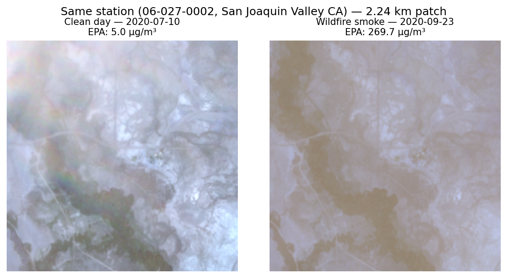

# Satellite-Imagery-Based PM2.5 Estimation

Predicting ground-level PM2.5 from Sentinel-2 satellite imagery at locations with no
air-quality monitor. MS thesis (Purdue University, 2026) — Pranay Chimmani.

<p align="center">
  
</p>

## Headline result

**Triple-FiLM context blend: R² 0.41–0.44 at never-seen stations, certified on two
independent station splits.** MAE ≈ 4 µg/m³, between-station R² +0.40–0.51,
exceedance (>35 µg/m³) AUC 0.93–0.95 / F1 0.49–0.56.

Every input is available anywhere on Earth without ground infrastructure: Sentinel-2
L1C imagery, ERA5-Land weather, SRTM elevation, solar geometry, and the calendar.

| Model | R² (split A / B) | What it shows |
|---|---|---|
| Proposal config (L2A weekly composites, frozen CNN) | 0.00 | no transferable signal |
| Fine-tuned image-only (single scenes, ±1h labels) | 0.31–0.39 | sync + end-to-end learning unlock signal |
| Image-only 3-model ensemble | 0.362–0.367 | first certified champion |
| **Triple-FiLM context blend** | **0.406 / 0.437** | **certified champion** |

## The two research questions

- **RQ1 — does location/time/weather context help?** Yes, if fused correctly. FiLM
  (context modulates image features) lifts R² and fixes place-ranking; naive
  concatenation *breaks* generalization (between-station −0.43) by memorizing
  coordinates. Physics-only context nearly doubles between-station ranking.
- **RQ2 — does label aggregation matter?** Synchronization matters up to the daily
  level, then stops (hourly = daily 0.377 > weekly 0.321 per-scene). For a weekly
  product, train on weekly labels and average scene predictions (0.383 vs 0.262).

## Repository map

```
configs/            pipeline.yaml — regions, years, product, paths (single source of truth)
scripts/            numbered pipeline CLIs (all resumable):
  01–04             EPA labels → GEE patch download → embeddings → dataset assembly
  05–06             classic-ML baselines
  07_finetune.py    fine-tuned CNN + FiLM/concat context fusion + weighting + splits
  08–09             overpass-hour labels, scene cleaning
  10_context_features.py   ERA5-Land + SRTM + solar geometry context vectors
  11_figures.py     regenerates all 23 thesis figures into docs/figures/
src/thesis/         config, EPA parsing, GEE download, models, splits, metrics
docs/EXPERIMENT_LOG.md   THE authoritative record — every experiment, table, finding
docs/figures/       thesis figure set
data/               gitignored (raw EPA, patches, parquets, model weights)
```

## Honest evaluation protocol

All headline numbers come from **held-out stations** — 20% of stations per state,
stratified, never seen during training in any form — with between/within-station R²
decomposition, spatial cross-validation, leave-region-out checks, pre-registered
ensemble composition, and bootstrap confidence intervals. Random-split numbers
(the leaderboard-friendly kind) run ~0.1–0.15 higher and are reported only as
memorization references.

## Key findings (details in docs/EXPERIMENT_LOG.md)

1. Weekly median composites + frozen ImageNet features have **zero** transferable
   signal — compositing erases the haze, ImageNet features are haze-invariant.
2. Single scenes + overpass-hour label sync + end-to-end fine-tuning: 0.00 → 0.39.
3. Fusion mechanism > feature choice: FiLM generalizes, concat memorizes.
4. Individual models are split-lottery; the 3-member blend is stable and beats the
   best member on both splits.
5. Skill decomposition: reliable place ranking + event detection; day-to-day
   resolution below ~20 µg/m³ is beyond passive RGB imaging (range-restricted
   R² analysis, §3v).

## Reproduction

```bash
conda activate thesis0
python scripts/01_build_labels.py         # EPA AQS 2020–2025, 5 states
python scripts/08_hour_labels.py          # overpass-hour label sync
python scripts/02_download_patches.py --mode scene   # GEE, every usable pass
python scripts/09_clean_scenes.py         # rules R1–R4
python scripts/10_context_features.py     # ERA5 + SRTM + solar context
python scripts/07_finetune.py --experiment film_full --labels scenehour --mode scene \
  --splits holdout --epochs 24 --patience 5 --min-epochs 12 --lr 2e-4 \
  --bucket-weights 1.1 1.0 1.3 6.2 8.8 --context --fusion film
# + --no-latlon and --ctx-cols lat,lon,doy_sin,doy_cos for the other two members;
# champion = mean of the three members' predictions
python scripts/11_figures.py              # regenerate all figures
```

GEE access requires an Earth Engine project (`gee.project` in configs/pipeline.yaml).
