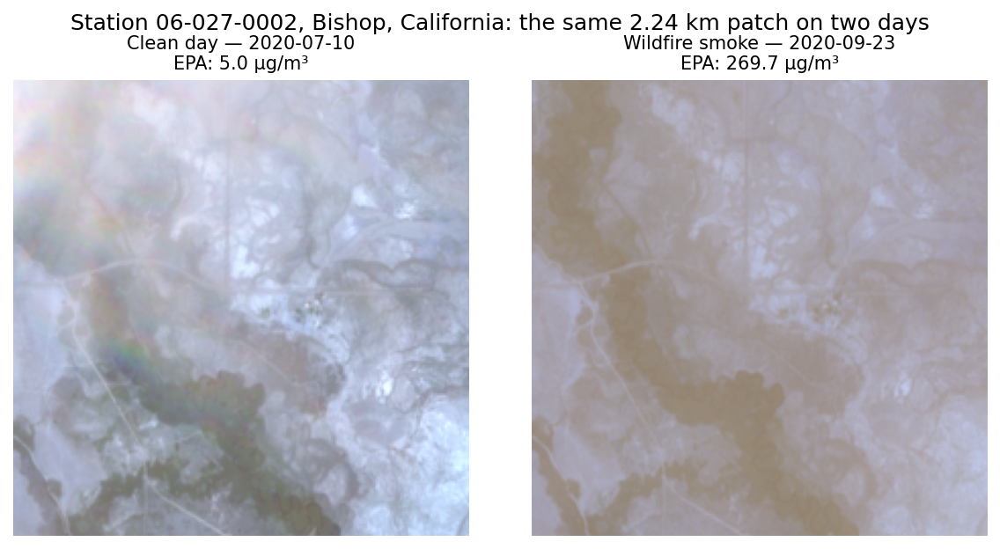

# Sentinel-2 scenes paired with ground-level PM2.5

A data pipeline that builds a dataset of Sentinel-2 satellite image patches, each labeled
with the PM2.5 concentration measured by a regulatory monitor **within one hour of the
satellite pass**, plus the weather, elevation and solar geometry of that moment. It uses
only free sources (EPA AQS, Copernicus Sentinel-2 via Google Earth Engine, ERA5-Land,
SRTM) and is configured by one YAML file, so it can be run for other states, years and
pollutants.

It was built for the MS thesis *Advancing Environmental Sustainability through Satellite
Imagery Based Estimation of PM2.5* (Pranay Chimmani, Purdue University, 2026). The
dataset released with the thesis covers 199 EPA stations in California, Texas, Washington,
Illinois and New York, 2020–2025: **54,347 scenes**, each a 224×224 pixel patch at 10 m
(2.24 km on a side) in the red, green and blue bands.

<p align="center">
  
</p>

## What a row of the dataset looks like

`data/processed/dataset.parquet` (and `.csv`), one row per scene:

| column | meaning |
|---|---|
| `station_id` | EPA site, `SS-CCC-NNNN` |
| `scene_date`, `pass_time_utc` | date and exact time of the Sentinel-2 acquisition |
| `pm25` | mean of the hourly PM2.5 readings within ±1 h of the pass, µg/m³ |
| `n_hours` | number of hourly readings in that window (2 or 3) |
| `lat`, `lon`, `region` | station location |
| `patch_path` | `.npy` array, 224×224×3, Level-1C top-of-atmosphere reflectance ×10,000 |
| `valid_fraction` | share of the patch classified clear by Cloud Score+ |
| `temp_c`, `rh`, `wind_speed`, `precip_mm`, `pressure_hpa` | ERA5-Land values for that day |
| `elevation_m` | SRTM elevation at the station |
| `sun_elev_deg` | solar elevation at the pass time |
| `doy_sin`, `doy_cos` | day of year as a sine and cosine pair |

Level-1C (before atmospheric correction) is used on purpose: the haze and smoke that
carry the PM2.5 signal are exactly what atmospheric correction removes.

## Quick start

```bash
git clone https://github.com/Proga97/Satellite-Imagery-Based-PM2.5-Estimation.git
cd Satellite-Imagery-Based-PM2.5-Estimation
conda env create -f environment.yml && conda activate pm25-pipeline   # or: pip install -r requirements.txt -e .
earthengine authenticate                      # once; needs a Google Earth Engine account
export EE_PROJECT=your-earth-engine-project   # or set gee.project in configs/pipeline.yaml
make check                                    # imports, device, config, Earth Engine access
make dataset                                  # the whole pipeline, resumable
```

`make dataset` runs the six stages below in order. Each stage skips what already exists,
so an interrupted run can be restarted and new years can be added without downloading
the old ones again. The full five-state, six-year dataset takes about a day, almost all
of it in the patch download; a single state and year takes well under an hour.

| stage | script | what it does |
|---|---|---|
| 1 | `01_build_labels.py` | downloads the EPA daily files, selects stations by coverage |
| 2 | `08_hour_labels.py` | downloads the EPA hourly files, finds every Sentinel-2 pass over each station and its exact time, labels each pass with the PM2.5 within ±1 h |
| 3 | `02_download_patches.py --mode scene` | downloads one patch per usable pass from Earth Engine, in parallel |
| 4 | `09_clean_scenes.py` | quality rules: label below 2.5 µg/m³, cloud with a low label, single-hour label, tile edge |
| 5 | `10_context_features.py` | ERA5-Land weather, SRTM elevation, solar elevation, day of year |
| 6 | `12_build_dataset.py` | joins everything into `dataset.parquet` / `dataset.csv` |

Run `make help` to see every target, and `python scripts/<name>.py --help` for options.

## Changing what is downloaded

Everything is in `configs/pipeline.yaml`:

```yaml
regions: [california, texas, newyork, washington, illinois]   # one file each in configs/region/
years: [2020, 2021, 2022, 2023, 2024, 2025]
labels:
  parameter_code: 88101        # EPA parameter: PM2.5 FRM/FEM mass
  min_week_coverage: 0.70      # keep a station if it reports in >= 70% of weeks ...
  coverage_years: [2023, 2024] # ... of these years
patches:
  product: l1c                 # l1c (top of atmosphere) or l2a (surface reflectance)
  size_px: 224
  scale_m: 10
  bands: [B4, B3, B2]
  min_valid_fraction: 0.6      # Cloud Score+ clear fraction below which a pass is skipped
  workers: 24
```

- **Another state:** add `configs/region/<name>.yaml` with the EPA state code and list it
  under `regions`. See [configs/region/README.md](configs/region/README.md).
- **Other years:** edit `years`. Sentinel-2 data begin in mid-2015; EPA hourly files
  exist for every year.
- **Another pollutant:** set `parameter_code` to one the EPA reports hourly (PM10 81102,
  ozone 44201, NO2 42602, SO2 42401). The label column is still called `pm25`. Only
  88101 has been run end to end; the daily-file stage keeps 24-hour sample durations,
  which may need adjusting for gases.
- **Outside the United States:** stages 1–2 read the EPA file format and would have to be
  replaced; stages 3–6 only need a station table and hourly values in UTC.

## The quality rules

Scenes are removed, not altered. For the released dataset, of 67,234 downloaded scenes:

| rule | removed | why |
|---|---|---|
| label below 2.5 µg/m³ | 8,991 | within the measurement noise of the hourly monitors (3% of all EPA hourly readings are negative) |
| clear fraction < 0.5 and label ≤ 20 µg/m³ | 2,803 | murk with a low label is cloud; murk with a high label is smoke and is kept |
| only one hourly reading in the ±1 h window | 555 | label too uncertain |
| more than 25% of pixels empty | 538 | tile edge |

`12_build_dataset.py --keep-rejected` keeps them with a `reason` column.

## Model and results (secondary)

The thesis trains a ResNet-18 on the patches, with the context features modulating the
image features through FiLM, and evaluates it only at stations never seen in training.
On two independent station splits the five-model ensemble reaches R² 0.435 / 0.435,
correlation 0.67, median absolute error 2.3–2.4 µg/m³ and an AUC of 0.93–0.95 for
detecting concentrations above 35 µg/m³. The image alone gives R² 0.24, the context alone
below 0.1, and the two together 0.39–0.43 for a single model.

- `scripts/07_finetune.py` trains a model; `make train` trains one FiLM member.
- `scripts/15_context_only.py` is the context-only baseline.
- `scripts/11_figures.py` regenerates `docs/figures/`.
- **The dataset is on the Hugging Face Hub:** [pr0gadiy/sentinel2-pm25-overpass-hour](https://huggingface.co/datasets/pr0gadiy/sentinel2-pm25-overpass-hour) (67,234 scenes with patches, 15.6 GB, streamable). `scripts/16_pack_huggingface.py` built it.
- Trained weights of the five ensemble members: GitHub release `v1.0-champion`.
- `docs/EXPERIMENT_LOG.md` is the complete record of every experiment and number.

## Repository map

```
configs/pipeline.yaml     all settings (regions, years, parameter code, patch size, paths)
configs/region/           one small file per state
scripts/                  the pipeline (01, 08, 02, 09, 10, 12), training (07, 15), figures (11),
                          thesis build (13, 14); scripts/legacy/ holds the early frozen-feature design
src/thesis/               config loading, EPA parsing, Earth Engine download, splits, metrics
tests/                    unit tests (make test); network tests (make smoke)
docs/figures/             figure set; docs/EXPERIMENT_LOG.md: the experiment record
data/                     not in git: raw EPA files, patches, parquet tables, model runs
```

## Citing

If you use the pipeline or the dataset, please cite the thesis:

> Chimmani, P. (2026). *Advancing Environmental Sustainability through Satellite Imagery
> Based Estimation of PM2.5*. MS thesis, Purdue University.

Data sources: U.S. EPA Air Quality System (public domain); Copernicus Sentinel-2 (free
and open under the Copernicus Sentinel Data Terms, attribution required); ERA5-Land
(Copernicus Climate Change Service, free and open); SRTM (NASA, public domain);
Cloud Score+ (Google). Code is MIT licensed.
